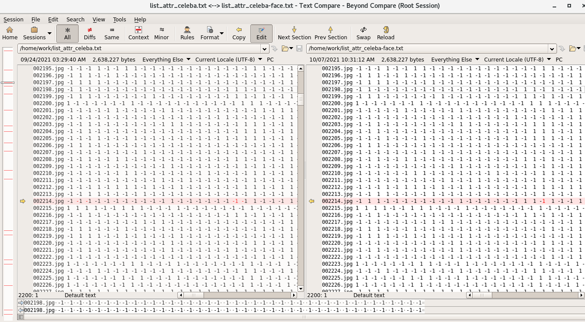

# face-property-detection-pytorch


[](https://www.python.org/)
[](https://www.python.org/)
[](https://pytorch.org/)


## 1. Data structure

The structure of landmarks_jpg is like below:

```
|--celeba1
|----celeba_face
|------000001.jpg
|------000002.jpg
|------ .....
|------020000.jpg
|----celeba_raw_pic
|------000001.jpg
|------000002.jpg
|------ .....
|------020000.jpg
```
The celeba_raw_pic is the original picture that we do not make any processing.
The celeba_face is the face region of the raw pricture.


<center>figure1: raw picture</center>


<center>figure2: face region of raw picture</center>

You can run the below command to finish the data processing.
```
python3 create_data.py 
```
This command will use MTCNN model to extract the face region. However, some pictures cannot be extracted by the model.
For my test, I can not cut out the face region of the below picture.
```
# file 000199.jpg cannot detect face
# file 001401.jpg cannot detect face
# file 002214.jpg cannot detect face
# file 002432.jpg cannot detect face
# file 002920.jpg cannot detect face
# file 003928.jpg cannot detect face
# file 003946.jpg cannot detect face
# file 004932.jpg cannot detect face
# file 005283.jpg cannot detect face
# file 006010.jpg cannot detect face
# file 006531.jpg cannot detect face
# file 007726.jpg cannot detect face
# file 008287.jpg cannot detect face
# file 011529.jpg cannot detect face
# file 011793.jpg cannot detect face
# file 013374.jpg cannot detect face
# file 013654.jpg cannot detect face
# file 014999.jpg cannot detect face
# file 016530.jpg cannot detect face
# file 016797.jpg cannot detect face
# file 017282.jpg cannot detect face
# file 017586.jpg cannot detect face
# file 018309.jpg cannot detect face
# file 018599.jpg cannot detect face
# file 018884.jpg cannot detect face
# file 019205.jpg cannot detect face
# file 019377.jpg cannot detect face

```
So I replace them with 000001.jpg.
Also, I revise the label file list_attr_celeba.txt. Replace the issue items with 000001.jpg and I get the 
list_attr_celeba-face.txt
You can use BeyondCompare to diff the changes that I make


You can download the data from the cloud drive:

| name                | link |
| ------------------- | ---- |
| celeba_face.zip   |  https://pan.baidu.com/s/1AJKpa0ac-6ZPWBASiMv87Q code: nujr |
| celeba_raw_pic.zip | https://pan.baidu.com/s/1wBAZMFkNQS6R6KLkRl6ktw code: zgl0  |

## 2. how to train
First, install the third-party package:
```
pip install -r requirements.txt
```

Then just simply run the below command:

```
python3 train.py
```
if you want to use the pretrained models, you can revise the below code as you need:
```
load_pretrain_model = False
model_dir=r".\pretrain_models\model-resnet-50-justface-state.ptn"
if load_pretrain_model:
    checkpoint = torch.load(model_dir)
    model.load_state_dict(checkpoint)
```

## 3. how to test 
Revise the test file name in predict.py and then run the below command:
```
python3 predict.py
```


